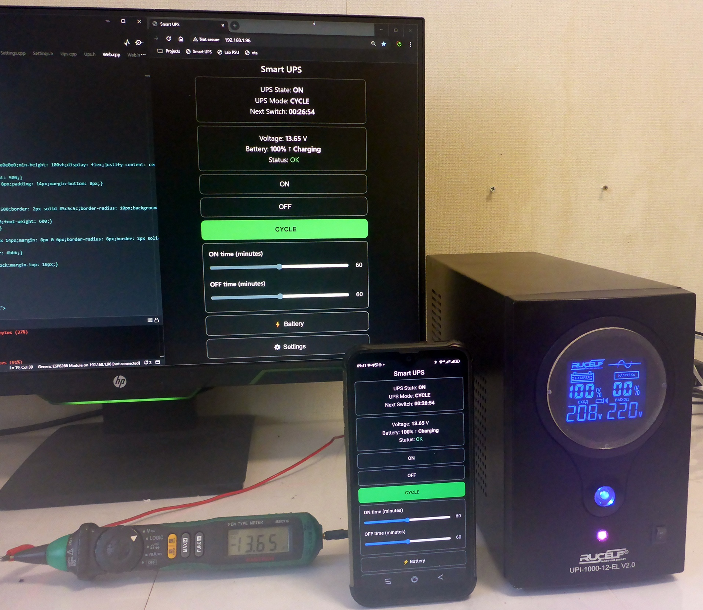
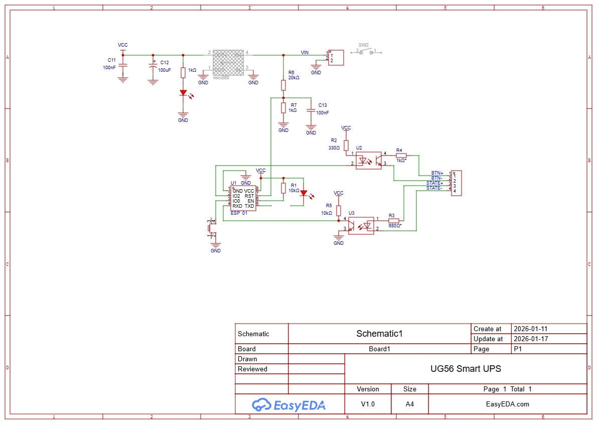
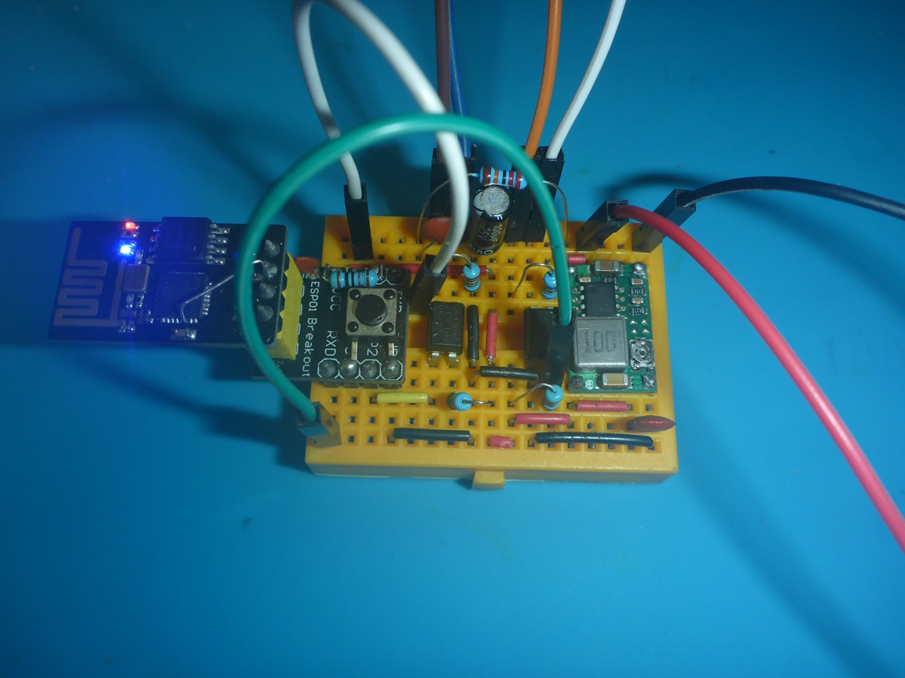
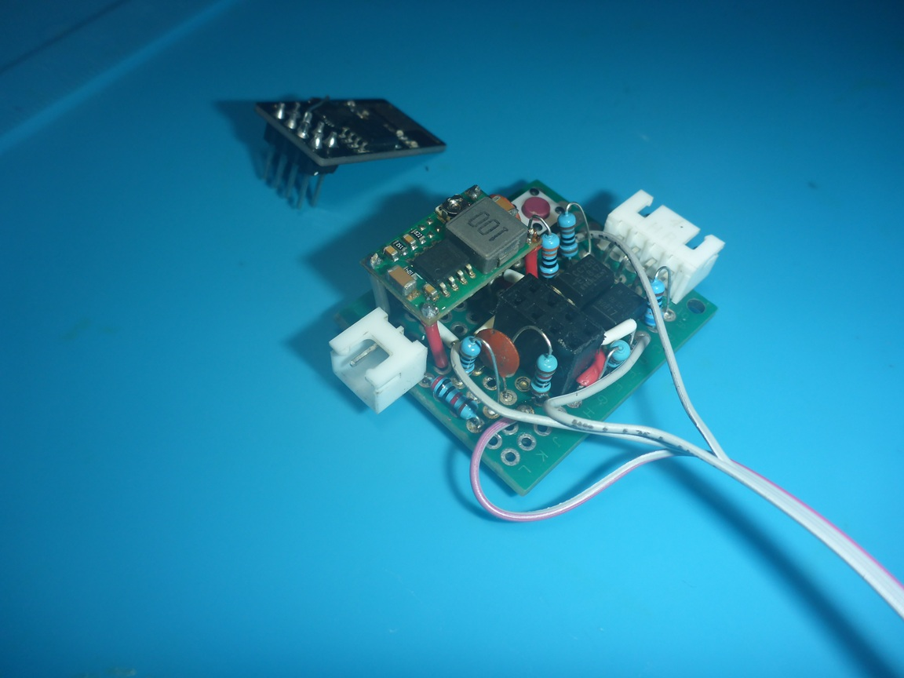

### UG56 Smart UPS

Minimalist **ESP8266-based controller** for smart power management of UPS, inverters or any device with a power button.

The controller is typically installed **inside the target device** and connects directly to:

- the power button  
- an ON/OFF feedback signal  
- the battery voltage  

UG56 Smart UPS can be **controlled locally** using a single button, or **remotely over Wi-Fi** via a built-in web interface.

It supports both **station mode** (connects to existing Wi-Fi) and **access point mode**, where the controller creates its own network for configuration and control.

The device periodically turns power ON and OFF to **extend usable battery runtime during long outages**, while keeping self-consumption low — without modifying firmware or relying on vendor-specific protocols.

---

---

## Visual overview

### Project cover



### Schematic



### Breadboard prototype



### Soldered version



📂 The **img/** folder contains ** more photos** than shown above.

---

## Demo

Live web interface demo (no real hardware required):  
https://universalgeek56.github.io/UG56-Smart-UPS/

---

## Why this exists

Most UPS and inverters are designed to stay ON all the time — even when the load doesn’t really need it.  
During long power outages this wastes energy on self-consumption instead of useful work.

UG56 Smart UPS solves this in the **simplest and most universal way**:
by automating the existing power button logic and adding **timed power cycles**.

In practice, you usually **have to open the device**:

- solder to the power button  
- connect a feedback line  
- install the controller inside the case  
- bring the button, LED and optional switch to the front or rear panel  

This is still a **logic-level non-invasive approach**:
no firmware hacks, no reverse engineering, no proprietary protocols — just a controlled, repeatable button press.

Wi-Fi is used for **remote control and configuration**:
cycle timings, thresholds and modes are set through the web interface,  
while the controller continues to operate autonomously even without a network.

---

## Key features

- **Modes**: OFF / ON / Cycle (configurable ON & OFF times)
- **One-button control**
  - short press → change mode  
  - long press → AP / STA switch  
- **LED feedback**: mode indication + OTA progress  
  (using onboard TX LED on ESP-01 or external led)
- **Battery protection**: low-voltage cutoff with hysteresis
- **Battery % estimation**: separate charge & discharge curves (lead-acid)
- **Offline-first**: fully functional without Wi-Fi
- **Web UI (optional)**: monitoring, control, OTA, Wi-Fi setup
- **Power saving**: Wi-Fi disabled automatically on critically low battery
- **Persistent settings**: stored in EEPROM

---

## Works with **any device that has a power button**, such as:

- UPS / inverter
- relay-based power modules
- generator controllers
- custom power devices

The controller **must know the current device state** (ON/OFF) to operate correctly.  
This is usually done via a simple feedback line connected to the device's power indicator or logic output.

No firmware changes or vendor-specific protocols are required — the controller simply:

- monitors the device state  
- simulates button presses when needed  
- applies timed power cycles autonomously

Supports **any ESP8266 module**, including the tiny **ESP-01**.

Battery voltage sensing on ESP-01 is done via a simple ADC hack:  
👉 https://github.com/universalgeek56/esp01-adc-hack

---

## Hardware

- ESP8266 module (ESP-01, NodeMCU, Wemos D1 Mini, etc.)
- Voltage divider for battery sensing (typically ~20kΩ / 1kΩ)
- 2× optocouplers (or transistors):
  - power button emulation  
  - device state feedback 
- Designed for **12V lead-acid UPS / inverters**

---

## Schematic & PCB

- EasyEDA project: *(add link here)*
- Wiring diagrams and photos:  
  https://github.com/universalgeek56/UG56-Smart-UPS/tree/main/img

---

## Quick start

1. Click **Code → Download ZIP**

2. Extract the archive

3. Rename the `src` folder and `main.ino` to the **same name**, for example:
   
   ```
   Smart_UPS/Smart_UPS.ino
   ```
   
   ⚠️ Use **Latin characters only**, no spaces or special symbols

4. Leave all other files unchanged

5. Copy the project folder to `Documents/Arduino/`

6. Open Arduino IDE → select board and port → upload

PlatformIO / Git / GitHub Desktop users can clone and build the project as usual.

---

## License

MIT License  
See `LICENSE` file for details.

---

## Related projects

- **ESP-01 ADC Hack**  
  Reliable analog input on ESP-01  
  [GitHub - universalgeek56/esp01-adc-hack: Simple ESP-01 hardware hack to expose ESP8266 ADC via RST pin for analog sensors and low-power projects.](https://github.com/universalgeek56/esp01-adc-hack)
